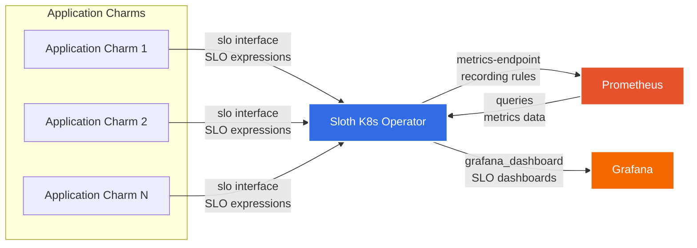

# Sloth Kubernetes Operator

Sloth provides SLI/SLO (Service Level Indicator/Service Level Objective) generation for Prometheus.
It generates Prometheus alerting and recording rules based on SLO specifications, helping teams
maintain and monitor their service reliability targets.

This operator builds a simple deployment of the Sloth server and provides a relation interface such
that it can be integrated with other Juju charms in a model.

## Architecture



**How it works:**
1. **Application charms** that implement SLI/SLOs relate to Sloth over the `slo` interface, providing SLO expressions
2. **Sloth** converts the SLO expressions to generate Prometheus recording rules
3. **Recording rules** are pushed to Prometheus via the `metrics-endpoint` relation
4. **Dashboards** are sent to Grafana via the `grafana_dashboard` relation for visualization
5. **Status page** is created by Sloth fetching metrics data from Prometheus

## Usage

You can deploy the operator as such:

```shell
# Deploy the charm
$ juju deploy sloth-k8s --trust --channel edge
```

Once the deployment is complete, grab the address of the Sloth application:

```bash
# assuming juju 3.6:
$ juju show-unit sloth-k8s/0 --format=json | jq -r '.["sloth-k8s/0"]["address"]'
```

## Configuration

Sloth generates SLO rules based on provided SLO specifications. The generated rules can be
consumed by Prometheus for monitoring service reliability.

### SLO Period Configuration

The charm supports two configuration options for controlling SLO period windows:

#### `slo-period` (default: `30d`)

The default SLO period for calculations. This determines the time window over which SLO
compliance is measured. Common values are:
- `30d` - 30 days (default, recommended for most use cases)
- `28d` - 28 days (4-week rolling window)
- `7d` - 7 days (for shorter-term SLOs)

```bash
juju config sloth-k8s slo-period=7d
```

#### `slo-period-windows` (optional)

Custom SLO period windows configuration in YAML format. This allows you to define custom
alerting windows that override Sloth's default alert window calculations.

The charm validates the configuration against the [Sloth AlertWindows specification](https://github.com/slok/sloth/tree/main/pkg/prometheus/alertwindows/v1) to ensure correctness. Invalid configurations are logged as errors and ignored.

When provided, this configuration defines:
- **Quick page alerts**: Fast detection of significant error budget consumption
- **Slow page alerts**: Detection of sustained error budget consumption
- **Quick ticket alerts**: Early warning of moderate error budget consumption
- **Slow ticket alerts**: Long-term trend monitoring

Example configuration for a 7-day SLO period:

```bash
juju config sloth-k8s slo-period-windows='
apiVersion: sloth.slok.dev/v1
kind: AlertWindows
spec:
  sloPeriod: 7d
  page:
    quick:
      errorBudgetPercent: 8
      shortWindow: 5m
      longWindow: 1h
    slow:
      errorBudgetPercent: 12.5
      shortWindow: 30m
      longWindow: 6h
  ticket:
    quick:
      errorBudgetPercent: 20
      shortWindow: 2h
      longWindow: 1d
    slow:
      errorBudgetPercent: 42
      shortWindow: 6h
      longWindow: 3d
'
```

**Configuration parameters explained:**
- `sloPeriod`: Must match your `slo-period` config value
- `errorBudgetPercent`: Percentage of error budget consumed to trigger alert (0-100)
- `shortWindow`: Shorter time window for detecting transient issues (e.g., "5m", "1h")
- `longWindow`: Longer time window for overall trend (e.g., "6h", "1d")

**Note**: The default 30d and 28d periods use Google's SRE Workbook recommended parameters.
Only configure custom windows if you need different alerting thresholds or are using
non-standard SLO periods.

For more information, see [Sloth's SLO Period Windows documentation](https://sloth.dev/usage/slo-period-windows/).

## Implementing SLO Support in Your Charm

To implement SLO support in a charm that defines its own SLI/SLO expressions, you need:

### 1. Add the Sloth library dependency

Add `charmlibs-interfaces-sloth` to your dependencies in your charm's preferred manner.

### 2. Import and instantiate SlothProvider

```python
from charmlibs.interfaces.sloth import SlothProvider

class YourCharm(CharmBase):
    def __init__(self, *args):
        super().__init__(*args)
        self.slo_provider = SlothProvider(self)
```

### 3. Define your SLO specification

Follow Sloth's format (as YAML string):

```python
slo_yaml = """
version: prometheus/v1
service: your-service-name
labels:
  team: your-team
slos:
  - name: availability
    objective: 99.9
    description: "99.9% availability"
    sli:
      events:
        error_query: 'sum(rate(http_requests_total{status=~"5.."}[{{.window}}]))'
        total_query: 'sum(rate(http_requests_total[{{.window}}]))'
    alerting:
      name: YourServiceHighErrorRate
      labels:
        severity: page
"""
```

### 4. Provide the SLO spec

Provide the SLO spec when appropriate (e.g., on pebble-ready, config-changed):

```python
self.slo_provider.provide_slos(slo_yaml)
```

### 5. Add metadata

In your charm's `charmcraft.yaml`:

```yaml
provides:
  slos:
    interface: slo
```

### 6. Relate to Sloth

```bash
juju relate your-charm:slos sloth-k8s:slos
```

The Sloth library supports dynamic SLO updates, Pydantic validation, and is designed for easy integration with any charm that wants to provide SLO specifications.
